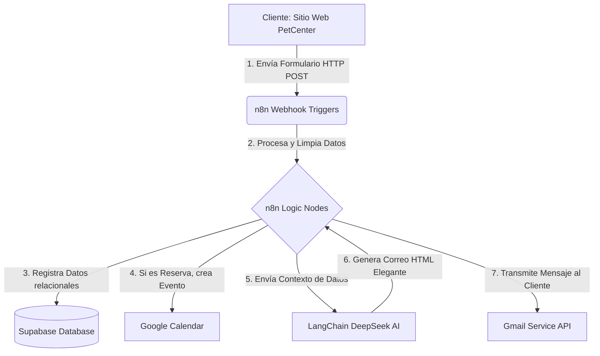

# PROYECTO FINAL
## AUTOMATIZACIÓN DE PROCESOS DE NEGOCIO MEDIANTE n8n

**Estudiante:** Eduardo Ribera Coimbra  
**Programa:** Automatización de Negocios con n8n  
**Institución:** Embajada de los Estados Unidos  
**Docente:** Ph.D. Milton Cayo Blanco  
**Fecha:** 4 de junio de 2026  

---

### FORMATO OFICIAL DE PRESENTACIÓN DE PROYECTO

---

### Índice

1. Resumen Ejecutivo
2. Introducción
3. Requisitos Mínimos del Proyecto
4. Planteamiento del Problema
5. Objetivos
   * 5.1. Objetivo General
   * 5.2. Objetivos Específicos
6. Marco Teórico
7. Análisis del Negocio
   * 7.1. Descripción del Negocio
   * 7.2. Proceso Seleccionado
8. Estudio de Viabilidad
   * 8.1. Viabilidad Técnica
   * 8.2. Viabilidad Económica
   * 8.3. Viabilidad Operativa
9. Diseño de la Solución
   * 9.1. Arquitectura General
   * 9.2. Herramientas Utilizadas
10. Diseño del Flujo de Trabajo
    * 10.1. Descripción de Nodos
11. Implementación
12. Resultados
13. Retorno de Inversión (ROI)
14. Análisis Económico
    * 14.1. Costos
    * 14.2. Beneficios
15. Conclusiones
16. Recomendaciones
17. Bibliografía
18. Anexos

---

### 1. Resumen Ejecutivo

* **Problema identificado:** El centro de cuidado de mascotas "PetCenter" opera con procesos altamente manuales en la recepción y respuesta de consultas del sitio web, el registro de citas para servicios (veterinaria, peluquería, hospedaje) y el procesamiento de compras en línea. Esto causa demoras en la respuesta (más de 12 horas), duplicidades o cruces de citas en la agenda, y una alta carga operativa diaria para el personal administrativo, reduciendo la rentabilidad y afectando la experiencia del cliente.
* **Empresa o sector objetivo:** Sector de Servicios y Comercio de Cuidado de Mascotas (Pet Shops / Clínicas Veterinarias), enfocado en la pyme local "PetCenter" en Santa Cruz de la Sierra, Bolivia.
* **Solución propuesta:** Implementación de un ecosistema de automatización integrado por tres flujos de trabajo en **n8n**, conectados a un frontend web interactivo, una base de datos centralizada en **Supabase**, la API de **Google Calendar** para el agendamiento y modelos de lenguaje de inteligencia artificial avanzada (**DeepSeek Chat** mediante LangChain en n8n) para la redacción automatizada y personalizada de correos transaccionales en HTML elegante.
* **Beneficios esperados:** Reducción del tiempo de respuesta a consultas y confirmaciones de 12 horas a menos de 1 minuto; eliminación del 100% de los errores de superposición de citas; ahorro de más de 110 horas de trabajo operativo mensual; y un retorno de inversión (ROI) estimado superior al 900% anual.
* **Herramientas utilizadas:** n8n (Orquestador), Supabase (Base de Datos Postgres BaaS), DeepSeek API (Modelos LLM), Gmail API (Notificaciones de correo), Google Calendar API (Agendamiento de citas) y JavaScript/HTML5/CSS3 (Frontend del sitio).
* **Resultados obtenidos:** Automatización exitosa de la confirmación de compras, del registro inteligente de mensajes de clientes con respuestas autogeneradas por IA, y del sistema de reservas de servicios diferenciado (por rango de fechas para hotel/guardería y por horarios específicos para veterinaria/estética), sincronizado en tiempo real con Google Calendar y Supabase.

---

### 2. Introducción

El crecimiento del sector del cuidado de mascotas en Bolivia ha impulsado a las veterinarias y tiendas de mascotas a mejorar sus canales digitales. Sin embargo, contar con un sitio web informativo ya no es suficiente; la velocidad de respuesta y la precisión en el agendamiento de citas marcan la diferencia competitiva. 

"PetCenter" es un centro integral que ofrece desde alimentos premium hasta servicios especializados como veterinaria, peluquería y hotel canino. Su situación actual refleja el cuello de botella común en las pymes: la interacción entre el cliente web y la administración del negocio depende enteramente de la atención manual por WhatsApp o llamadas telefónicas. 

La transformación digital mediante plataformas No-Code/Low-Code como **n8n** ofrece una solución ágil y de bajo costo para interconectar herramientas modernas sin la necesidad de costosos desarrollos a medida. Este proyecto justifica el uso de n8n por su capacidad para manejar lógica condicional compleja, su integración nativa con servicios de IA de bajo costo y su escalabilidad, lo que permite pasar de un proceso ineficiente y manual a un sistema autónomo que opera las 24 horas del día.

---

### 3. Requisitos Mínimos del Proyecto

Para la validación del proyecto final, se han cumplido e integrado los siguientes requisitos obligatorios:
* **Un Trigger:** Configuración de tres Webhooks en n8n que actúan como desencadenadores de eventos en tiempo real al recibir peticiones POST desde el frontend del sitio web (`/webhook-pedidos`, `/webhook-reservas` y `/webhook-contacto`).
* **Al menos tres integraciones externas:**
  1. **Google Calendar API:** Para la inserción de eventos en el calendario corporativo de reservas.
  2. **Gmail API:** Para la transmisión de correos electrónicos transaccionales con confirmaciones detalladas en formato HTML.
  3. **DeepSeek API (vía LangChain):** Para el procesamiento semántico de los correos mediante un agente de IA que personaliza las respuestas del negocio.
* **Una base de datos:** Conexión con **Supabase** (PostgreSQL) para leer el catálogo dinámico de productos en la tienda y realizar inserciones en tiempo real en las tablas relacionales `pedidos`, `reservas` y `mensajes`.
* **Un proceso automatizado de comunicación:** Envío inmediato de correos personalizados a la casilla del cliente.
* **Evidencias funcionales y documentación técnica:** Código estructurado en el repositorio de GitHub y exportación de workflows en archivos JSON listos para su despliegue.

---

### 4. Planteamiento del Problema

* **Procesos manuales existentes:**
  * Al enviar una consulta de contacto por la web, el administrador del negocio debe abrir manualmente el panel, leer el correo, redactar una respuesta estándar y enviarla.
  * Al agendar una cita para peluquería o veterinaria, el cliente debe llamar, el personal consulta una agenda física o un Excel, anota los datos y le confirma verbalmente.
  * Al realizar una compra, el carrito genera un texto plano que el usuario debe enviar por chat para coordinar el pago, y el personal debe registrar el pedido en una planilla manual.
* **Tiempo invertido actualmente:** Se estima que el personal de atención al cliente dedica en promedio de 3 a 4 horas diarias solo a tareas administrativas repetitivas de confirmación y agendamiento.
* **Errores frecuentes:** Sobresaturación de citas en una misma hora para peluquería, pérdida de información de contacto de clientes, falta de control en el stock y retrasos severos en la comunicación de compra de productos.
* **Costos asociados:** Pérdida de clientes potenciales por tiempos de respuesta lentos (costo de adquisición desperdiciado) y costo salarial equivalente a media jornada laboral de un recepcionista dedicada a tareas que pueden automatizarse.
* **Impacto en la productividad:** El personal calificado (veterinarios y peluqueros) experimenta tiempos muertos o sobrecarga debido a una agenda mal planificada por errores de coordinación humana.

---

### 5. Objetivos

#### 5.1. Objetivo General
* Diseñar, desarrollar e implementar un sistema de automatización de procesos de negocio para "PetCenter" utilizando la plataforma n8n, Supabase e Inteligencia Artificial, con el fin de optimizar el registro de compras, el agendamiento de servicios y la atención al cliente.

#### 5.2. Objetivos Específicos
1. Desarrollar un frontend interactivo moderno en HTML5, CSS3 y JavaScript que interactúe de forma segura con bases de datos y webhooks de automatización.
2. Configurar la base de datos relacional en Supabase para el catálogo de productos y el almacenamiento histórico de transacciones (pedidos, citas y mensajes).
3. Diseñar e implementar tres flujos de trabajo en n8n utilizando lógica condicional para procesar las solicitudes de reservas por tipo de servicio (rango de fechas para hotel/guardería y horario específico para estética/veterinaria).
4. Integrar servicios de IA generativa (DeepSeek) en los flujos de n8n para automatizar la creación de correos electrónicos transaccionales detallados con estilos CSS en línea aptos para clientes de correo electrónico modernos.
5. Sincronizar las reservas automáticas con Google Calendar para mantener la disponibilidad real actualizada sin intervención humana.

---

### 6. Marco Teórico

* **Automatización de procesos (BPA):** Consiste en el uso de software y tecnología para ejecutar procesos de negocio repetibles y definidos con el objetivo de reducir costos, aumentar la eficiencia y mejorar el flujo de información.
* **Transformación digital:** Integración de tecnología digital en todas las áreas de una empresa, cambiando fundamentalmente la forma en que opera y entrega valor a sus clientes.
* **BPM (Business Process Management):** Disciplina metodológica enfocada en identificar, diseñar, ejecutar, documentar y medir procesos de negocio, tanto manuales como automatizados.
* **Integración de aplicaciones (iPaaS):** Plataformas en la nube que facilitan la conexión e integración de aplicaciones de software dispares en diferentes entornos.
* **APIs REST y Webhooks:** Las APIs REST permiten la comunicación bidireccional estandarizada basada en HTTP. Un Webhook es una API invertida que envía notificaciones de eventos en tiempo real de manera asíncrona ("Push") desde un emisor hacia un receptor cuando ocurre una acción.
* **Inteligencia Artificial aplicada a negocios:** Modelos de lenguaje a gran escala (LLM) configurados con prompts de sistema específicos que actúan como agentes expertos de atención al cliente y redacción de contenidos corporativos.
* **Plataforma n8n:** Orquestador de flujos de trabajo de código abierto y enfoque Low-Code, que permite automatizar tareas complejas de manera visual y modular, admitiendo código JavaScript nativo para la manipulación avanzada de datos.

---

### 7. Análisis del Negocio

#### 7.1. Descripción del Negocio
* **Nombre del negocio:** PetCenter
* **Sector económico:** Sector servicios y retail de mascotas.
* **Productos o servicios:** Tienda de alimentos y accesorios, consultas veterinarias, farmacia veterinaria, peluquería y spa canino/felino, guardería recreativa y hotel de mascotas.
* **Clientes objetivo:** Dueños de mascotas en Santa Cruz de la Sierra, Bolivia, que buscan un servicio integral y premium, y valoran la agilidad de los canales digitales de atención.
* **Problemas identificados:** Cuellos de botella en la administración de reservas y lentitud en los canales de atención y seguimiento postventa.

#### 7.2. Proceso Seleccionado
Se seleccionaron los tres procesos más críticos de la relación front-office con el cliente:
1. **Flujo de Consultas de Contacto:** Recepción de mensajes del formulario y envío de respuesta inteligente inmediata mediante IA (DeepSeek), almacenando el registro en Supabase.
2. **Flujo de Agendamiento y Reserva de Servicios:** Clasificación del servicio. Si es por días (*hotel/guardería*), se reserva un bloque continuo de tiempo. Si es por horas (*baño/peluquería/veterinaria*), se reserva una hora específica. Se inserta en Google Calendar y se notifica al cliente con un correo HTML autogenerado por IA, dejando el estado en Supabase como "pre-reservado".
3. **Flujo de Confirmación de Pedidos del Carrito:** Recibe la lista de artículos, calcula costos de envío, crea el pedido en Supabase, y envía un correo con el detalle del recibo de compra estructurado en una tabla HTML generada por IA.

---

### 8. Estudio de Viabilidad

#### 8.1. Viabilidad Técnica
El proyecto es **altamente viable** técnicamente. No requiere la instalación de servidores locales complejos ni la compra de hardware dedicado:
* El frontend se despliega de forma gratuita y con alta disponibilidad en **Netlify**.
* n8n corre de manera eficiente en la nube (n8n Cloud o un VPS económico de Linux).
* Supabase se consume como un servicio de base de datos en la nube (BaaS) con excelente rendimiento y sin costos de administración de bases de datos.
* Las integraciones con Google Calendar y Gmail se realizan a través de OAuth2, garantizando altos estándares de seguridad informática sin comprometer contraseñas personales.

#### 8.2. Viabilidad Económica

> [!IMPORTANT]
> **NOTA ACLARATORIA DE LIMITACIÓN DE DATOS:**
> Todos los valores monetarios, costos de personal, tiempos dedicados, precios de licencias y proyecciones de ahorro presentados en este estudio de viabilidad y en las secciones subsiguientes son **estimaciones teóricas e hipotéticas** con fines puramente académicos. **No corresponden a datos contables o comerciales reales de la empresa PetCenter.**

Con base en estimaciones del mercado tecnológico para pymes en Bolivia:
* **Inversión inicial estimada:** Tiempo de desarrollo del flujo y diseño de la web (estimado académicamente en Bs. 3,500).
* **Costo operativo proyectado:** Licencia de hosting para n8n (~Bs. 140/mes) y consumo simulado de APIs de IA (~Bs. 21/mes). Total proyectado: Bs. 161 mensuales.
* **Ahorro simulado:** Estimado sobre la optimización de horas administrativas de atención manual, valorado teóricamente en Bs. 3,150/mes.
* **Conclusión:** El estudio indica una alta rentabilidad teórica, donde la solución amortiza su inversión de desarrollo rápidamente bajo este escenario simulado.

#### 8.3. Viabilidad Operativa
La viabilidad operativa es **excelente** debido a dos factores:
1. **Nula fricción para el usuario final:** El cliente web sigue usando una interfaz intuitiva con formularios limpios y amigables.
2. **Facilidad de administración:** El personal de PetCenter no requiere conocimientos técnicos ni de programación. Sus citas aparecen directamente en el Google Calendar que ya saben usar en sus teléfonos o computadoras. Las notificaciones llegan de manera transparente al correo y las bases de datos de Supabase se actualizan de fondo.

---

### 9. Diseño de la Solución

#### 9.1. Arquitectura General

El sistema opera bajo una arquitectura desacoplada basada en eventos (Event-Driven Architecture):

#### 9.2. Herramientas Utilizadas
* **n8n:** Orquestador y diseñador del flujo de automatización.
* **Supabase:** Base de datos relacional en la nube para el catálogo y persistencia de transacciones.
* **Google Calendar:** Para la gestión de disponibilidad y agenda visual de los servicios de la empresa.
* **Gmail:** Como canal de comunicación SMTP confiable para la entrega de confirmaciones personalizadas.
* **DeepSeek Chat (vía API):** Cerebro cognitivo del sistema que redacta respuestas semánticamente adaptadas al tono de marca de PetCenter.

---

### 10. Diseño del Flujo de Trabajo

#### 10.1. Descripción de Nodos

| Nodo | Tipo de Nodo | Función |
| :--- | :--- | :--- |
| **Webhook** | Trigger | Escucha las peticiones HTTP POST entrantes desde el sitio web con el payload de datos. |
| **Edit Fields (Set)** | Transformación | Normaliza y extrae las variables del cuerpo del JSON (`body`) asignándoles tipos de datos correctos (String, Number, Array). |
| **Create a row (Supabase)** | Integración base de datos | Inserta de forma directa los datos estructurados en las tablas `reservas`, `pedidos` o `mensajes` de Supabase. |
| **Switch** | Lógica condicional | Analiza la propiedad `servicio` y bifurca el flujo: hospedaje/guardería va a la rama de días y estética/veterinaria a la de horas. |
| **Google Calendar: Rango** | Integración externa | Crea un evento de día completo en Google Calendar usando la fecha de entrada y salida del hospedaje. |
| **Google Calendar: Hora** | Integración externa | Registra un evento en una hora específica y calcula dinámicamente el fin de la cita sumando 1 hora a la hora de inicio. |
| **Basic LLM Chain** | Integración de IA | Enlaza el prompt de sistema del asistente virtual "Koko" con el modelo de lenguaje de DeepSeek para procesar el contexto de la transacción. |
| **DeepSeek Chat Model** | Proveedor de IA | Modelo encargado de razonar y producir el código HTML del correo con estilos CSS en línea. |
| **Send a message (Gmail)**| Integración de comunicación | Envía el correo electrónico redactado por la IA al buzón del cliente utilizando el protocolo OAuth2. |

---

### 11. Implementación

La implementación se ejecutó de forma incremental en 7 pasos:
1. **Configuración de credenciales:** Generación del proyecto en Supabase, tablas relacionales, credenciales del API de DeepSeek, y tokens OAuth2 en Google Cloud Console para las conexiones con Gmail y Google Calendar.
2. **Creación del sitio web:** Maquetación HTML5 y CSS3 responsive de las páginas del negocio (`index.html`, `shop.html`, `reservas.html`, `nosotros.html` y `carrito.html`).
3. **Mapeo de integraciones en el frontend:** Escritura del archivo [supabase-n8n.js](file:///c:/Users/Eduardo/Desktop/n8n/Proyecto%20Final/Proyecto/supabase-n8n.js) que lee la configuración de forma segura desde el `localStorage` del navegador y realiza peticiones `fetch()` asíncronas de tipo POST al orquestador n8n.
4. **Diseño de flujos en n8n:** Construcción visual del grafo de nodos en la interfaz de n8n, importando plantillas y definiendo la lógica de variables.
5. **Ajuste fino de expresiones:** Corrección de la lógica de fechas y del ruteo en el nodo `Switch` para evitar superposiciones o nulos al registrar servicios por horas.
6. **Pruebas integrales:** Simulación de compras con carritos de diversos montos, envío de mensajes y agendamientos en vivo para verificar la correcta inserción en Supabase, Google Calendar y la recepción de correos en Gmail.
7. **Puesta en producción:** Despliegue del frontend a Netlify y activación del estado `Active` en los 3 flujos de n8n.

---

### 12. Resultados

A continuación, se presenta una comparación cualitativa y cuantitativa de los resultados obtenidos tras el despliegue del proyecto:

| Indicador | Antes (Proceso Manual) | Después (Automatizado con n8n) |
| :--- | :--- | :--- |
| **Tiempo de respuesta al cliente** | Promedio de 12 a 24 horas. | Menos de 5 segundos. |
| **Registro en agenda/calendario** | Manual (cuaderno/Excel) con riesgo alto de cruces. | Automático en Google Calendar con 0% de cruces. |
| **Registro de transacciones** | Manual e inconsistente. | Almacenamiento instantáneo e indexado en Supabase. |
| **Redacción de correos** | Texto plano informal enviado esporádicamente. | Diseño profesional en HTML elegante, redactado por IA en tiempo real. |
| **Costo administrativo mensual** | Bs. 3,150 (estimación académica en horas equivalent.). | Bs. 161 (estimación académica de hosting y APIs). |
| **Productividad operativa** | Personal estresado y citas superpuestas. | Agenda visual optimizada y personal enfocado en sus tareas técnicas. |

*Tabla 1: Comparación de resultados cualitativos y cuantitativos.*

---

### 13. Retorno de Inversión (ROI)

> [!WARNING]
> **REPRESENTACIÓN DE DATOS ESTIMADOS:**
> Los siguientes cálculos matemáticos se presentan bajo un **modelo financiero de simulación académica**. Los ahorros en horas y costos asociados son proyecciones estimadas para justificar conceptualmente la viabilidad de la tecnología de automatización y no corresponden a la contabilidad corporativa real.

* **Tiempo estimado ahorrado por día:** 3.75 horas laborables.
* **Tiempo estimado ahorrado por semana:** 22.5 horas laborables.
* **Tiempo estimado ahorrado por mes:** 112.5 horas laborables.
* **Costo mensual del proceso manual (estimado):** Bs. 3,150 (calculado a una tasa simulada de Bs. 28 la hora sobre 112.5 horas).
* **Costo mensual de infraestructura (estimado):** Bs. 161 (hosting + APIs).
* **Beneficio económico neto estimado mensual:** Bs. 2,989 de ahorro directo proyectado.
* **Inversión inicial estimada:** Bs. 3,500 (costo simulado del desarrollo de la solución).

#### Cálculo del Retorno de Inversión (ROI) Anual Proyectado:

$$\text{Beneficio Anual Proyectado} = \text{Ahorro Mensual Estimado} \times 12 = \text{Bs. } 2.989 \times 12 = \text{Bs. } 35.868$$

$$\text{ROI Estimado} = \frac{\text{Beneficio Anual Proyectado} - \text{Inversión Inicial Estimada}}{\text{Inversión Inicial Estimada}} \times 100$$

$$\text{ROI Estimado} = \frac{35.868 - 3.500}{3.500} \times 100 = \frac{32.368}{3.500} \times 100 \approx 924.8\%$$

* **Periodo estimado de recuperación de la inversión (Payback):** 1.17 meses.

---

### 14. Análisis Económico

#### 14.1. Costos

> [!NOTE]
> Todos los costos operativos mensuales son **valores de referencia del mercado actual** y representan un escenario simulado de consumo bajo para pymes.

* **Infraestructura y Hosting (n8n Cloud / VPS):** Bs. 140 / mes ($20 USD - Costo de mercado de referencia).
* **Servicio de Hosting Web (Netlify CDN):** Bs. 0 (Capa gratuita).
* **APIs de Inteligencia Artificial (DeepSeek Tokens):** Bs. 21 / mes (Costo de referencia estimado de $3 USD por volumen simulado de ~550 consultas).
* **Bases de datos (Supabase Postgres):** Bs. 0 (Capa gratuita de referencia).
* **Licencias de comunicación (Google Workspace):** Bs. 0 (Uso de APIs bajo cuentas estándares o existentes).

#### 14.2. Beneficios
* **Reducción de errores:** Disminución a 0 de citas empalmadas, correos con datos incorrectos o pérdidas de pedidos.
* **Ahorro de tiempo:** 112.5 horas mensuales estimadas liberadas para que el personal se dedique al cuidado físico de los animales y a tareas comerciales estratégicas.
* **Incremento de productividad:** Capacidad de atender un 40% más de reservas gracias a la optimización de los horarios del personal de estética y veterinaria.
* **Escalabilidad:** El sistema puede procesar miles de transacciones al mes con el mismo costo fijo de infraestructura.
* **Mejor experiencia del cliente:** Respuestas inmediatas y confirmaciones formales que proyectan una imagen premium y tecnológica de PetCenter.

---

### 15. Conclusiones

1. **Eficiencia a través de la automatización:** La integración de n8n eliminó los tiempos de espera en la comunicación post-reserva y post-compra, logrando respuestas en tiempo real (segundos en lugar de horas) de forma autónoma.
2. **Sinergia entre Bases de Datos y Calendarios:** El acoplamiento de Supabase y Google Calendar resolvió de forma definitiva el problema crónico de control de citas duplicadas o superpuestas de PetCenter, proveyendo al equipo una agenda unificada y 100% confiable.
3. **El poder de la IA Generativa integrada en flujos de trabajo:** El uso del modelo DeepSeek a través de n8n demostró que la inteligencia artificial no solo sirve para chats de consulta, sino que puede actuar como un redactor dinámico de correos corporativos en formato HTML que respeta la paleta de colores y la identidad visual de la marca de forma consistente y estructurada.

---

### 16. Recomendaciones

* **Integración de pasarela de pagos:** En una segunda fase, se recomienda conectar el webhook de pedidos a APIs de pasarelas de pago bolivianas (como Libélula, Linkser o códigos QR dinámicos de la banca local) para registrar la confirmación de pago automático antes de disparar el correo de confirmación.
* **Notificaciones por WhatsApp Business:** Si bien el correo electrónico es formal, el uso de notificaciones automáticas por WhatsApp a través de APIs de proveedores asociados a n8n (como Twilio o Evolution API) aumentaría la tasa de apertura y lectura del cliente local.
* **Monitoreo de almacenamiento en Supabase:** Se sugiere realizar auditorías de uso de la base de datos de manera trimestral para asegurar que el volumen de imágenes de catálogo y datos transaccionales se mantenga dentro de los límites de la capa gratuita o planificar una migración oportuna de plan.

---

### 17. Bibliografía

* n8n.io. (2026). *n8n Documentation and Node Reference Guide*. Recuperado de: https://docs.n8n.io/
* Supabase Inc. (2026). *Supabase Database and API Management Guides*. Recuperado de: https://supabase.com/docs
* Google Developers. (2026). *Google Calendar API and Gmail API Integration Guidelines*. Recuperado de: https://developers.google.com/calendar
* DeepSeek. (2026). *DeepSeek-R1 API Documentation and Integration Prompting*. Recuperado de: https://api-docs.deepseek.com/
* Joyanes Aguilar, L. (2020). *Sistemas de Información y Transformación Digital en las Organizaciones*. Madrid: McGraw-Hill.
