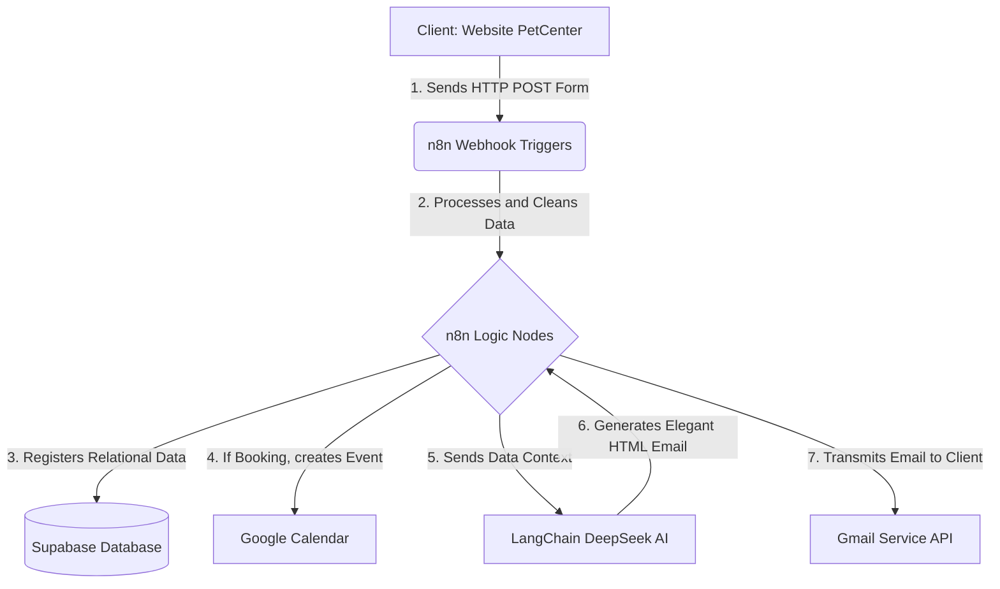

# FINAL PROJECT
## BUSINESS PROCESS AUTOMATION USING n8n

**Student:** Eduardo Ribera Coimbra  
**Program:** Business Automation with n8n  
**Institution:** Embassy of the United States  
**Teacher:** Ph.D. Milton Cayo Blanco  
**Date:** June 4, 2026  

---

### OFFICIAL PROJECT PRESENTATION FORMAT

---

### Table of Contents

1. Executive Summary
2. Introduction
3. Minimum Project Requirements
4. Problem Statement
5. Objectives
   * 5.1. General Objective
   * 5.2. Specific Objectives
6. Theoretical Framework
7. Business Analysis
   * 7.1. Business Description
   * 7.2. Selected Process
8. Feasibility Study
   * 8.1. Technical Feasibility
   * 8.2. Economic Feasibility
   * 8.3. Operational Feasibility
9. Solution Design
   * 9.1. General Architecture
   * 9.2. Tools Used
10. Workflow Design
    * 10.1. Node Description
11. Implementation
12. Results
13. Return on Investment (ROI)
14. Economic Analysis
    * 14.1. Costs
    * 14.2. Benefits
15. Conclusions
16. Recommendations
17. Bibliography
18. Annexes

---

### 1. Executive Summary

* **Identified Problem:** The pet care center "PetCenter" operates with highly manual processes in receiving and responding to website inquiries, booking appointments for services (veterinary, grooming, lodging), and processing online shopping orders. This leads to severe delays in response times (exceeding 12 hours), double bookings in the schedule, and a heavy daily operational workload for administrative staff, reducing profitability and impacting the customer experience.
* **Target Company or Sector:** Pet Care Services and Retail Sector (Pet Shops / Veterinary Clinics), focusing on the local SME "PetCenter" in Santa Cruz de la Sierra, Bolivia.
* **Proposed Solution:** Implementation of an automation ecosystem integrated by three workflows in **n8n**, connected to a modern interactive web frontend, a centralized database in **Supabase**, the **Google Calendar API** for scheduling, and advanced artificial intelligence language models (**DeepSeek Chat** via LangChain in n8n) for the automated, customized drafting of elegant transactional HTML emails.
* **Expected Benefits:** Reduction of response times for inquiries and confirmations from 12 hours to less than 1 minute; elimination of 100% of double-booking errors; savings of over 110 hours of manual administrative work monthly; and a simulated Return on Investment (ROI) exceeding 900% annually.
* **Tools Used:** n8n (Orchestrator), Supabase (Postgres BaaS Database), DeepSeek API (LLM Models), Gmail API (Email Notifications), Google Calendar API (Appointment Scheduling), and JavaScript/HTML5/CSS3 (Website Frontend).
* **Results Obtained:** Successful automation of purchase order confirmations, intelligent logging of client messages with auto-generated AI responses, and a service reservation system split by logic type (range of dates for lodging/daycare and specific time slots for veterinary/grooming), synchronized in real time with Google Calendar and Supabase.

---

### 2. Introduction

The growth of the pet care sector in Bolivia has driven veterinary clinics and pet shops to improve their digital channels. However, having a simple informational website is no longer enough; response speed and scheduling precision make the competitive difference.

"PetCenter" is an all-in-one pet wellness center offering premium food, veterinary consulting, grooming, and lodging. Its current situation reflects a common bottleneck in SMEs: the interaction between the web customer and the business administration relies entirely on manual attention via WhatsApp or phone calls.

Digital transformation through Low-Code/No-Code platforms like **n8n** offers an agile and low-cost solution to interconnect modern cloud services without the need for expensive custom software developments. This project justifies the use of n8n due to its ability to handle complex conditional logic, its native integration with affordable AI services, and its scalability, allowing a transition from an inefficient, manual process to an autonomous system operating 24/7.

---

### 3. Minimum Project Requirements

To validate the final project, the following mandatory requirements have been met and integrated:
* **One Trigger:** Setup of three Webhooks in n8n acting as real-time triggers upon receiving HTTP POST requests from the website frontend (`/webhook-pedidos`, `/webhook-reservas`, and `/webhook-contacto`).
* **At least three external integrations:**
  1. **Google Calendar API:** For creating events in the corporate booking calendar.
  2. **Gmail API:** For sending transactional emails with detailed confirmations formatted in HTML.
  3. **DeepSeek API (via LangChain):** For semantic processing of emails through an AI Agent that customizes the business's response.
* **One database:** Connection to **Supabase** (PostgreSQL) to read the product catalog on the shop page and perform real-time insertions into the `pedidos`, `reservas`, and `mensajes` tables.
* **An automated communication process:** Immediate delivery of personalized emails to the client's inbox.
* **Functional evidence and technical documentation:** Structured code in the GitHub repository and exported workflows in JSON files ready for deployment.

---

### 4. Problem Statement

* **Existing manual processes:**
  * When a contact query is sent through the web, the administrator must manually check the dashboard, read the email, draft a generic response, and send it.
  * When booking a grooming or veterinary appointment, the customer must call, the staff checks a physical notebook or Excel, writes down the details, and confirms verbally.
  * When making a purchase, the shopping cart generates a plain text block that the user must send via chat to coordinate payment, and staff must register the order manually in spreadsheets.
* **Time currently spent:** It is estimated that customer service staff spends an average of 3 to 4 hours daily solely on repetitive administrative confirmation and scheduling tasks.
* **Frequent errors:** Overlap of grooming appointments for the same hour, loss of client contact info, lack of stock control, and delays in notifying customers about purchases.
* **Associated costs:** Loss of potential customers due to slow response times (wasted customer acquisition costs) and labor costs equivalent to half a receptionist's shift dedicated to tasks that can be automated.
* **Impact on productivity:** Qualified staff (veterinarians and groomers) experience downtime or overbooking stress due to poor scheduling coordination.

---

### 5. Objectives

#### 5.1. General Objective
* To design, develop, and implement a business process automation system for "PetCenter" using the n8n platform, Supabase, and Artificial Intelligence to optimize purchase logging, service scheduling, and customer service.

#### 5.2. Specific Objectives
1. Develop a modern interactive frontend in HTML5, CSS3, and JavaScript that interacts securely with databases and automation webhooks.
2. Configure the relaltional database in Supabase for the product catalog and historical transaction storage (orders, reservations, and messages).
3. Design and implement three n8n workflows using conditional logic to process booking requests by service type (date range for hotel/daycare and specific hours for grooming/vet).
4. Integrate generative AI services (DeepSeek) into n8n workflows to automate the creation of detailed transactional emails with inline CSS styles suitable for modern email clients.
5. Scribe automatic reservations to Google Calendar to maintain real-time availability without human intervention.

---

### 6. Theoretical Framework

* **Business Process Automation (BPA):** The use of software and technology to execute repeatable, defined business processes to reduce costs, increase efficiency, and improve information flow.
* **Digital Transformation:** Integration of digital technology into all areas of a business, fundamentally changing how it operates and delivers value to customers.
* **BPM (Business Process Management):** A methodological discipline focused on identifying, designing, executing, documenting, and measuring business processes, both manual and automated.
* **Application Integration (iPaaS):** Cloud-based suites that facilitate the connection and integration of disparate software applications across different environments.
* **REST APIs and Webhooks:** REST APIs allow standardized, bi-directional communication based on HTTP. A Webhook is an inverted API that sends real-time event notifications asynchronously ("Push") from a sender to a receiver when an action occurs.
* **Artificial Intelligence applied to business:** Large Language Models (LLMs) configured with specific system prompts that act as expert agents for customer service and corporate copywriting.
* **n8n Platform:** An open-source, Low-Code workflow orchestrator that allows the visual and modular automation of complex tasks, supporting native JavaScript code for advanced data manipulation.

---

### 7. Business Analysis

#### 7.1. Business Description
* **Business name:** PetCenter
* **Economic sector:** Pet services and retail sector.
* **Products or services:** Pet food and accessories shop, veterinary consulting, pet pharmacy, dog/cat grooming and spa, recreational daycare, and pet hotel.
* **Target clients:** Pet owners in Santa Cruz de la Sierra, Bolivia, seeking comprehensive and premium services, and valuing the agility of digital channels.
* **Identified problems:** Bottlenecks in reservation management and slow response times in customer service and post-sale follow-ups.

#### 7.2. Selected Process
Three critical front-office processes were selected:
1. **Contact Inquiries Flow:** Captures form messages and triggers an immediate, smart response via IA (DeepSeek), storing the records in Supabase.
2. **Service Scheduling and Booking Flow:** Classifies the service. If it is by days (*hotel/daycare*), it reserves a continuous block of time. If it is by hours (*grooming/vet*), it reserves a specific hour. It registers it in Google Calendar and notifies the client with an HTML email autogenerated by AI, setting the database status to "pre-reserved".
3. **Cart Orders Confirmation Flow:** Receives the item list, calculates shipping fees, creates the order in Supabase, and sends an email with receipt details structured in an HTML table generated by AI.

---

### 8. Feasibility Study

#### 8.1. Technical Feasibility
The project is **highly feasible** technically. It does not require complex local server setups or dedicated hardware purchases:
* The web frontend is deployed for free and with high availability on **Netlify**.
* n8n runs efficiently in the cloud (n8n Cloud or an inexpensive Linux VPS).
* Supabase is consumed as a cloud database service (BaaS) with excellent performance and zero maintenance database overhead.
* Integrations with Google Calendar and Gmail are done via OAuth2, guaranteeing high security standards without compromising personal passwords.

#### 8.2. Economic Feasibility

> [!IMPORTANT]
> **DISCLAIMER OF DATA LIMITATION:**
> All monetary values, labor costs, time dedicated, license prices, and savings projections presented in this feasibility study and the following sections are **theoretical and hypothetical estimates** for purely academic purposes. **They do not represent real accounting or commercial data of the company PetCenter.**

Based on market estimates for SMEs in Bolivia:
* **Estimated initial investment:** Flow development and web design time (academically estimated at Bs. 3,500).
* **Projected monthly operational cost:** n8n hosting license (~Bs. 140/month) and simulated AI API consumption (~Bs. 21/month). Projected total: Bs. 161 monthly.
* **Simulated savings:** Estimated on the optimization of administrative hours of manual attention, theoretically valued at Bs. 3,150/month.
* **Conclusion:** The study indicates high theoretical profitability, where the solution quickly amortizes its development investment under this simulated scenario.

#### 8.3. Operational Feasibility
Operational feasibility is **excellent** due to two factors:
1. **Zero friction for the end-user:** Web clients continue using an intuitive interface with clean, friendly forms.
2. **Ease of administration:** PetCenter staff does not require programming knowledge. Bookings appear directly in the Google Calendar they already use on their devices. Notifications are delivered transparently to the email, and Supabase databases are updated in the background.

---

### 9. Solution Design

#### 9.1. General Architecture

The system operates under a decoupled Event-Driven Architecture:

#### 9.2. Tools Used
* **n8n:** Orchestrator and workflow designer.
* **Supabase:** Cloud relational database for catalogs and transaction persistence.
* **Google Calendar:** For availability management and a visual schedule of services.
* **Gmail:** Reliable SMTP communication channel for personalized confirmations.
* **DeepSeek Chat (via API):** The cognitive brain that drafts responses adapted to PetCenter's brand tone.

---

### 10. Workflow Design

#### 10.1. Node Description

| Node | Node Type | Function |
| :--- | :--- | :--- |
| **Webhook** | Trigger | Listens for incoming HTTP POST requests from the website with the data payload. |
| **Edit Fields (Set)** | Transformation | Normalizes and extracts variables from the JSON body, assigning correct data types (String, Number, Array). |
| **Create a row (Supabase)** | DB Integration | Inserts structured data directly into Supabase tables `reservas`, `pedidos`, or `mensajes`. |
| **Switch** | Conditional logic | Analyzes the `servicio` property and forks the flow: hotel/daycare to the day branch, grooming/vet to the hour branch. |
| **Google Calendar: Rango** | External Integration | Creates an all-day event in Google Calendar using the hotel check-in and check-out dates. |
| **Google Calendar: Hora** | External Integration | Registers an event at a specific time and dynamically calculates the end of the appointment by adding 1 hour to start. |
| **Basic LLM Chain** | AI Integration | Links the system prompt of virtual assistant "Koko" with the DeepSeek language model to process transaction context. |
| **DeepSeek Chat Model** | AI Provider | Model in charge of reasoning and generating the email HTML code with inline CSS. |
| **Send a message (Gmail)**| Communication | Sends the AI-written email to the client's mailbox using OAuth2. |

---

### 11. Implementation

Implementation was executed incrementally in 7 steps:
1. **Credentials Setup:** Supabase project creation, relational tables, DeepSeek API keys, and OAuth2 credentials setup in Google Cloud Console.
2. **Website Creation:** Responsive HTML5/CSS3 layouts of business pages (`index.html`, `shop.html`, `reservas.html`, `nosotros.html`, and `carrito.html`).
3. **Frontend Integration Mapping:** Writing [supabase-n8n.js](file:///c:/Users/Eduardo/Desktop/n8n/Proyecto%20Final/Proyecto/supabase-n8n.js) to securely read credentials from `localStorage` and trigger asynchronous POST requests.
4. **n8n Flow Design:** Visual construction of the node graph in n8n, importing templates, and defining variable logic.
5. **Expression Tuning:** Adjusting dates and routing rules in the `Switch` node to prevent calendar overlap and handle nulls for hour-based services.
6. **End-to-End Testing:** Simulated shopping carts, queries, and live bookings to verify Database and Calendar sync and Gmail deliveries.
7. **Deployment:** Pushing frontend to Netlify and setting the 3 n8n workflows to `Active`.

---

### 12. Results

The table below presents a qualitative and quantitative comparison of the results obtained after deployment:

| Indicator | Before (Manual Process) | After (n8n Automated) |
| :--- | :--- | :--- |
| **Client Response Time** | Average of 12 to 24 hours. | Less than 5 seconds. |
| **Agenda/Calendar Entry** | Manual (notebook/Excel) with high overlap risk. | Automatic in Google Calendar with 0% overlap. |
| **Transaction Logging** | Manual and inconsistent. | Instant and indexed storage in Supabase. |
| **Email Drafting** | Plain text sent sporadically. | Professional HTML designed by AI in real-time. |
| **Monthly Admin Cost** | Bs. 3,150 (academic time estimation equivalent). | Bs. 161 (academic hosting and API estimation). |
| **Operational Productivity** | Stressed staff and double bookings. | Optimized visual calendar; staff focused on core tasks. |

*Table 1: Comparison of qualitative and quantitative results.*

---

### 13. Return on Investment (ROI)

> [!WARNING]
> **REPRESENTATION OF ESTIMATED DATA:**
> The following mathematical calculations are presented under an **academic simulation financial model**. The saved hours and associated costs are estimated projections to justify the conceptual viability of the automation technology and do not correspond to actual corporate accounting.

* **Estimated time saved per day:** 3.75 working hours.
* **Estimated time saved per week:** 22.5 working hours.
* **Estimated time saved per month:** 112.5 working hours.
* **Monthly cost of manual process (estimated):** Bs. 3,150 (calculated at a simulated rate of Bs. 28/hour over 112.5 hours).
* **Monthly cost of infrastructure (estimated):** Bs. 161 (hosting + APIs).
* **Estimated net monthly benefit:** Bs. 2,989 of projected direct savings.
* **Estimated initial investment:** Bs. 3,500 (simulated cost of solution development).

#### Projected Annual Return on Investment (ROI) Calculation:

$$\text{Projected Annual Benefit} = \text{Estimated Monthly Savings} \times 12 = \text{Bs. } 2,989 \times 12 = \text{Bs. } 35,868$$

$$\text{Estimated ROI} = \frac{\text{Projected Annual Benefit} - \text{Estimated Initial Investment}}{\text{Estimated Initial Investment}} \times 100$$

$$\text{Estimated ROI} = \frac{35,868 - 3,500}{3,500} \times 100 = \frac{32,368}{3,500} \times 100 \approx 924.8\%$$

* **Estimated Payback Period:** 1.17 months.

---

### 14. Economic Analysis

#### 14.1. Costs

> [!NOTE]
> All monthly operating costs are **current market references** representing a simulated low-consumption scenario for SMEs.

* **Infrastructure and Hosting (n8n Cloud / VPS):** Bs. 140 / month ($20 USD - reference market cost).
* **Web Hosting Service (Netlify CDN):** Bs. 0 (Free tier reference).
* **AI APIs (DeepSeek Tokens):** Bs. 21 / month (Estimated reference cost of $3 USD for ~550 queries).
* **Databases (Supabase Postgres):** Bs. 0 (Free tier reference).
* **Communication Licenses (Google Workspace):** Bs. 0 (APIs used under existing accounts).

#### 14.2. Benefits
* **Error Reduction:** Reduction to 0 of double bookings, incorrect customer data, or lost orders.
* **Time Savings:** 112.5 estimated hours saved monthly so staff can focus on animal physical care and strategic commercial tasks.
* **Productivity Increase:** Ability to handle 40% more bookings due to schedule optimization for groomers and veterinarians.
* **Scalability:** The system can process thousands of transactions per month with the same fixed infrastructure cost.
* **Better Customer Experience:** Immediate responses and formal receipts projecting a premium, tech-forward brand image.

---

### 15. Conclusions

1. **Efficiency Through Automation:** The integration of n8n eliminated waiting times in post-booking and post-purchase communication, achieving autonomous real-time responses (seconds instead of hours).
2. **Database and Calendar Synergy:** Coupling Supabase and Google Calendar resolved PetCenter's chronic double-booking problems, providing a single, 100% reliable schedule.
3. **Power of Generative AI in Workflows:** Using the DeepSeek model through n8n proved that AI is not just for chat conversations, but acts as a dynamic HTML email writer, consistently respecting brand visual guidelines.

---

### 16. Recommendations

* **Payment Gateway Integration:** In a second phase, connecting the order webhook to Bolivian payment gateways (such as Libélula, Linkser, or dynamic banking QR codes) would automate payment confirmations before sending emails.
* **WhatsApp Business Notifications:** While email is official, sending automated WhatsApp notifications using providers connected to n8n (like Twilio or Evolution API) would increase open rates for local customers.
* **Supabase Storage Monitoring:** Periodic audits of database usage are recommended to ensure catalog images and transactional logs remain within the free tier limits, planning for an upgrade when necessary.

---

### 17. Bibliography

* n8n.io. (2026). *n8n Documentation and Node Reference Guide*. Retrieved from: https://docs.n8n.io/
* Supabase Inc. (2026). *Supabase Database and API Management Guides*. Retrieved from: https://supabase.com/docs
* Google Developers. (2026). *Google Calendar API and Gmail API Integration Guidelines*. Retrieved from: https://developers.google.com/calendar
* DeepSeek. (2026). *DeepSeek-R1 API Documentation and Integration Prompting*. Retrieved from: https://api-docs.deepseek.com/
* Joyanes Aguilar, L. (2020). *Information Systems and Digital Transformation in Organizations*. Madrid: McGraw-Hill.
